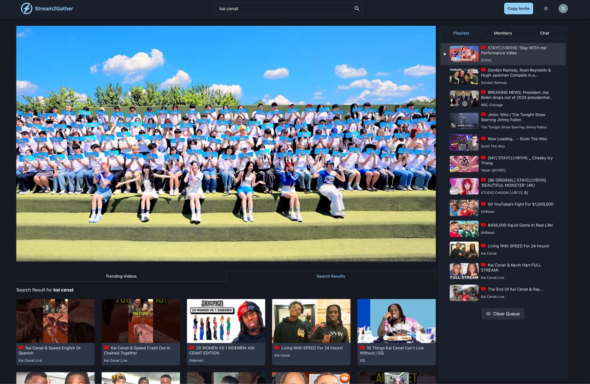

<!-- markdownlint-disable MD033 MD041 -->

<h1 align="center">Stream2Gather</h1>

## Overview

**Stream2Gather** is an online video streaming site designed to provide a seamless media playback experience. It mimics watching YouTube videos with friends in real life by synchronizing play, pause, and seek events within a virtual room using Socket.io. Users can search for videos by keyword and add them to a playlist queue.

Powered by web sockets, **Stream2Gather** allows real-time communication within rooms through live chats. Currently, the platform fully supports YouTube, and the next update will introduce support for Dailymotion and Twitch.

## Built With

- React
- Next.js
- Chakra UI
- Express.js
- GraphQL with Apollo Server
- PostgreSQL
- Socket.io
- TypeORM
- Firebase

## Installation

Please refer to the [frontend](/frontend/README.md) folder and [backend](/backend/README.md) folder for the respective installation.

## License

This project is licensed under the MIT License - see the [LICENSE](LICENSE)