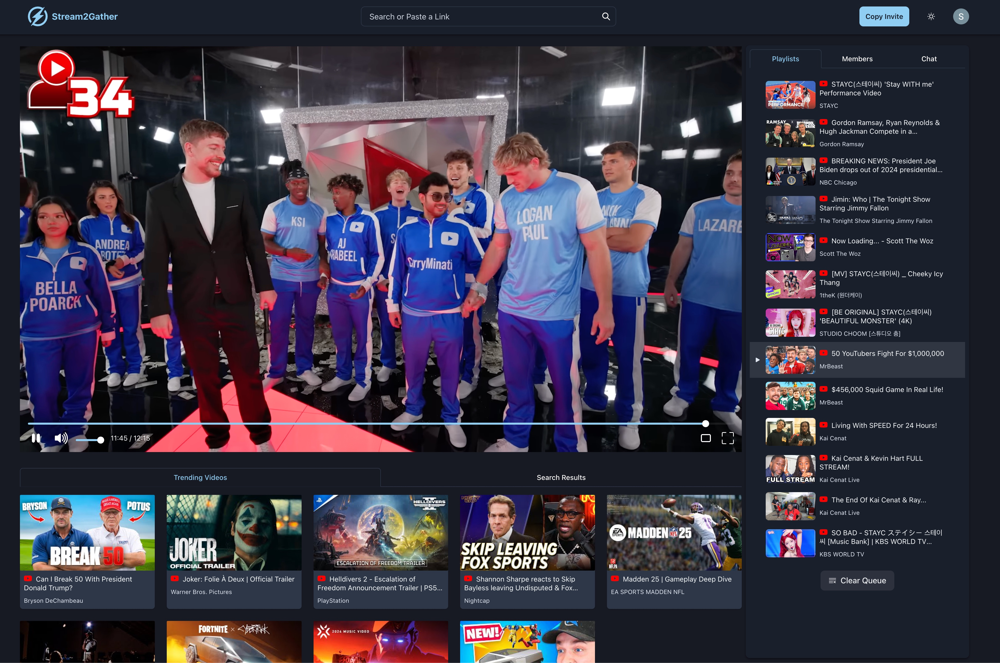
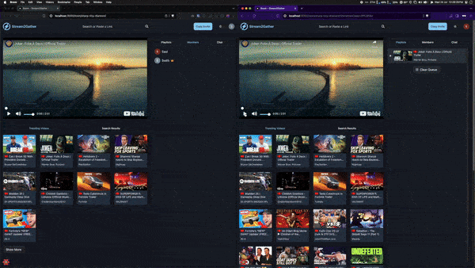
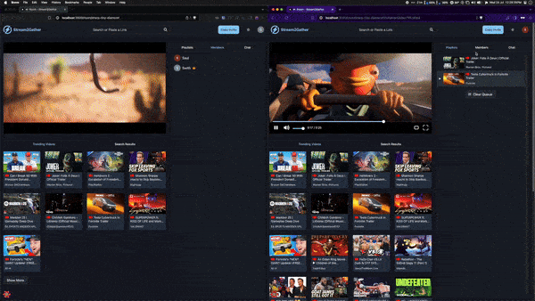

<!-- markdownlint-disable MD033 MD041 -->

<h1 align="center">Stream2Gather</h1>

<b>Stay connected made easier</b>

## Overview

**Stream2Gather** is an online video streaming site designed to provide a seamless media playback experience. It mimics watching YouTube videos with friends in real life by synchronizing play, pause, and seek events within a virtual room using Socket.io. Users can search for videos by keyword and add them to a playlist queue.

Powered by web sockets, **Stream2Gather** allows real-time communication within rooms through live chats. Currently, the platform fully supports YouTube, and the next update will introduce support for Dailymotion and Twitch.

## Quick Demo

### Video Controls and Playback

### Live Chat

## Built With

- [React](https://reactjs.org/) - JavaScript library for building user interfaces
- [Next.js](https://nextjs.org/) - React framework for server-side rendering and static site generation
- [Chakra UI](https://chakra-ui.com/) - Modular and accessible component library for React
- [Express.js](https://expressjs.com/) - Web application framework for Node.js
- [GraphQL with Apollo Server](https://www.apollographql.com/docs/apollo-server/) - Data query language and server for building a unified API
- [PostgreSQL](https://www.postgresql.org/) - Relational database management system for data storage
- [Redis](https://redis.io/) - In-memory data store used for caching and session management
- [Socket.io](https://socket.io/) - Library for real-time web applications
- [TypeORM](https://typeorm.io/) - ORM for TypeScript and JavaScript (ES7) that supports different databases
- [Firebase Authentication](https://firebase.google.com/products/auth) - Service for user authentication and authorization

## Installation

Please refer to the [frontend](/frontend/README.md) folder and [backend](/backend/README.md) folder for the respective installation.

## License

This project is licensed under the MIT License - see the [LICENSE](LICENSE)
